# DriveBuy Backend Architecture Flow

```mermaid
---
config:
      theme: redux
---
flowchart TD
    Start(["Frontend Request"])
    
    %% Request Entry Points
    Start --> RestAPI["REST API Endpoints<br/>Spring Boot 3.3.4<br/>Kotlin"]
    Start --> WebSocketAPI["WebSocket Endpoints<br/>STOMP Protocol<br/>/ws"]
    
    %% Authentication Layer
    RestAPI --> AuthCheck{"Authentication<br/>Required?"}
    WebSocketAPI --> WSAuth["WebSocket Auth<br/>Interceptor"]
    
    AuthCheck -->|Public| PublicEndpoints["Public Endpoints<br/>• GET /ads (browse)<br/>• GET /brands, /models<br/>• GET /locations<br/>• GET /colors"]
    AuthCheck -->|Protected| FirebaseAuth["Firebase JWT<br/>Token Validation"]
    
    WSAuth --> FirebaseAuth
    FirebaseAuth --> AuthValid{"Token Valid?"}
    AuthValid -->|No| AuthError["401 Unauthorized"]
    AuthValid -->|Yes| AuthSuccess["Authentication Success"]
    
    %% Controller Layer
    PublicEndpoints --> Controllers["Controllers Layer"]
    AuthSuccess --> Controllers
    
    Controllers --> AdController["AdController<br/>• Create/Edit/Delete Ads<br/>• Search & Filter<br/>• Image Upload"]
    Controllers --> UserController["UserController<br/>• Registration/Login<br/>• Profile Management<br/>• User Data"]
    Controllers --> ChatController["ChatController<br/>• Create Chats<br/>• Message History<br/>• Mark as Read"]
    Controllers --> LocationController["LocationController<br/>• Cities/Regions<br/>• Location Search"]
    Controllers --> CarInfoController["Car Info Controllers<br/>• Brands & Models<br/>• Technical Specs"]
    Controllers --> WebSocketController["WebSocketController<br/>• Real-time Chat<br/>• Join/Leave Rooms"]
    
    %% Service Layer
    AdController --> AdService["AdService<br/>Business Logic"]
    UserController --> UserService["UserService<br/>Business Logic"]
    ChatController --> ChatService["ChatService<br/>Business Logic"]
    LocationController --> LocationService["LocationService<br/>Business Logic"]
    CarInfoController --> CarInfoServices["Car Info Services<br/>Business Logic"]
    WebSocketController --> ChatService
    
    %% External Services Integration
    UserService --> FirebaseAPI["Firebase Authentication<br/>• User Creation<br/>• Token Validation<br/>• User Management"]
    AdService --> FirebaseStorage["Firebase Storage<br/>• Image Upload<br/>• File Management"]
    ChatService --> NotificationService["Notification Service<br/>• Real-time Updates<br/>• Message Delivery"]
    
    %% AI Integration (Future/Planned)
    AdService --> AIService["AI Assistant Service<br/>• LLM Integration<br/>• Car Recommendations<br/>• Search Enhancement"]
    
    %% Repository Layer
    AdService --> AdRepository["AdRepository<br/>JPA/Hibernate"]
    UserService --> UserRepository["UserRepository<br/>JPA/Hibernate"]
    ChatService --> ChatRepository["ChatRepository<br/>JPA/Hibernate"]
    ChatService --> MessageRepository["MessageRepository<br/>JPA/Hibernate"]
    LocationService --> LocationRepository["LocationRepository<br/>JPA/Hibernate"]
    CarInfoServices --> CarInfoRepositories["Car Info Repositories<br/>JPA/Hibernate"]
    
    %% Database Layer
    AdRepository --> PostgreSQL["PostgreSQL Database"]
    UserRepository --> PostgreSQL
    ChatRepository --> PostgreSQL
    MessageRepository --> PostgreSQL
    LocationRepository --> PostgreSQL
    CarInfoRepositories --> PostgreSQL
    
    %% Database Entities
    PostgreSQL --> Entities["Database Entities<br/>• UserEntity<br/>• CarAdEntity<br/>• ChatEntity<br/>• MessageEntity<br/>• LocationEntity<br/>• CarBrandEntity<br/>• CarModelEntity"]
    
    %% Data Validation
    Controllers --> Validation["Spring Validation<br/>Framework<br/>• Input Validation<br/>• Data Consistency"]
    Validation --> Services["Services Layer"]
    Services --> AdService
    Services --> UserService
    Services --> ChatService
    Services --> LocationService
    Services --> CarInfoServices
    
    %% Real-time Communication
    WebSocketController --> STOMPBroker["STOMP Message Broker<br/>• /topic destinations<br/>• Real-time delivery"]
    STOMPBroker --> ClientNotifications["Client Notifications<br/>• Chat Messages<br/>• Status Updates"]
    
    %% Response Flow
    PostgreSQL --> ResponseData["Response Data"]
    FirebaseAPI --> ResponseData
    FirebaseStorage --> ResponseData
    ClientNotifications --> ResponseData
    ResponseData --> JSONResponse["JSON Response<br/>to Frontend"]
    
    %% Error Handling
    AuthError --> ErrorHandler["Global Exception<br/>Handler"]
    Validation --> ValidationError["Validation Errors"]
    ValidationError --> ErrorHandler
    Services --> ServiceError["Service Exceptions"]
    ServiceError --> ErrorHandler
    ErrorHandler --> ErrorResponse["Error Response<br/>to Frontend"]
    
    %% System Architecture Styling
    classDef controllerLayer fill:#4285f4,stroke:#333,stroke-width:2px,color:#fff
    classDef serviceLayer fill:#34a853,stroke:#333,stroke-width:2px,color:#fff
    classDef repositoryLayer fill:#fbbc04,stroke:#333,stroke-width:2px,color:#fff
    classDef externalService fill:#ea4335,stroke:#333,stroke-width:2px,color:#fff
    classDef databaseLayer fill:#9aa0a6,stroke:#333,stroke-width:2px,color:#fff
    classDef websocketLayer fill:#ff6d01,stroke:#333,stroke-width:2px,color:#fff
    
    class AdController,UserController,ChatController,LocationController,CarInfoController,WebSocketController controllerLayer
    class AdService,UserService,ChatService,LocationService,CarInfoServices,NotificationService,AIService serviceLayer
    class AdRepository,UserRepository,ChatRepository,MessageRepository,LocationRepository,CarInfoRepositories repositoryLayer
    class FirebaseAPI,FirebaseStorage externalService
    class PostgreSQL,Entities databaseLayer
    class WebSocketAPI,WSAuth,WebSocketController,STOMPBroker,ClientNotifications websocketLayer
```

## Backend Architecture Summary

### 🏗️ **Architecture Pattern**
- **Framework**: Spring Boot 3.3.4 with Kotlin
- **Pattern**: RESTful API + WebSocket for real-time communication
- **Architecture**: Layered architecture (Controller → Service → Repository → Database)

### 🔐 **Authentication & Security**
- **Firebase Authentication**: JWT token validation
- **Security**: Spring Security integration
- **WebSocket Auth**: Custom interceptors for real-time connections
- **Authorization**: Role-based access control

### 📡 **API Endpoints**

#### Public Endpoints (No Authentication)
- `GET /ads/*` - Browse car listings
- `GET /brands, /models, /colors` - Reference data
- `GET /locations/*` - Location data

#### Protected Endpoints (JWT Required)
- `POST/PUT/DELETE /ads/*` - Ad management
- `GET/PUT /users/*` - User management
- `GET/POST /chats/*` - Chat functionality
- `POST /ads/saved` - Save favorite ads

### 🔄 **Real-time Communication**
- **WebSocket**: `/ws` endpoint with SockJS fallback
- **Protocol**: STOMP messaging
- **Features**: Real-time chat, message delivery, read receipts
- **Authentication**: JWT tokens in WebSocket headers

### 🗄️ **Data Persistence**
- **Database**: PostgreSQL
- **ORM**: JPA/Hibernate
- **Entities**: Users, Ads, Chats, Messages, Locations, Car Data
- **Validation**: Spring Validation Framework

### 🔗 **External Integrations**
- **Firebase Auth**: User management and authentication
- **Firebase Storage**: Image upload and management
- **AI Service**: LLM integration for car recommendations (planned)

### 🏢 **System Features**
- **Modular Design**: Clear separation of concerns
- **Scalability**: Stateless REST + WebSocket support
- **Validation**: Comprehensive input validation
- **Error Handling**: Global exception handling
- **Transaction Management**: Database transaction support
- **Image Processing**: Multipart file upload support

### 🚀 **Deployment**
- **Platform**: Render Cloud Deployment
- **Configuration**: Environment-based configuration
- **Database**: PostgreSQL cloud instance
- **Storage**: Firebase Storage for media files
