# DriveBuy Backend - Simple Architecture

```mermaid
---
config:
      theme: redux
---
flowchart TD
    Frontend["Frontend App<br/>(Flutter)"]
    
    %% Main Backend
    Frontend --> API["DriveBuy Backend<br/>Spring Boot + Kotlin<br/>REST API + WebSocket"]
    
    %% Core Features
    API --> Auth["🔐 Authentication<br/>Firebase JWT"]
    API --> Ads["🚗 Car Ads<br/>CRUD Operations"]
    API --> Chat["💬 Real-time Chat<br/>WebSocket/STOMP"]
    API --> Users["👤 User Management<br/>Profiles & Settings"]
    API --> Search["🔍 Search & Filter<br/>Car Listings"]
    
    %% External Services
    Auth --> Firebase["Firebase<br/>Auth + Storage"]
    
    %% Database
    Ads --> DB["PostgreSQL<br/>Database"]
    Chat --> DB
    Users --> DB
    Search --> DB
    
    %% Data Structure
    DB --> Tables["📊 Main Tables<br/>• Users<br/>• Car Ads<br/>• Chats<br/>• Messages<br/>• Locations<br/>• Car Data"]
    
    %% Responses
    Tables --> Response["JSON Response"]
    Firebase --> Response
    Response --> Frontend
    
    %% Styling
    classDef backend fill:#4285f4,stroke:#333,stroke-width:3px,color:#fff
    classDef external fill:#ea4335,stroke:#333,stroke-width:2px,color:#fff
    classDef database fill:#34a853,stroke:#333,stroke-width:2px,color:#fff
    classDef frontend fill:#ff6d01,stroke:#333,stroke-width:2px,color:#fff
    
    class API backend
    class Firebase external
    class DB,Tables database
    class Frontend frontend
```

## Simple Backend Overview

### 🏗️ **What it is**
Spring Boot backend in Kotlin that provides REST API + WebSocket for a car marketplace app.

### 🔑 **Main Features**
- **🔐 Authentication**: Firebase JWT tokens (email/password only)
- **🚗 Car Ads**: Create, edit, delete, browse car listings with image upload
- **💬 Real-time Chat**: WebSocket chat between buyers/sellers
- **👤 User Management**: User profiles, registration, and settings
- **🔍 Search & Filter**: Advanced filtering and search for car listings
- **📱 File Upload**: Multipart image upload with Firebase Storage

### 💾 **Data Storage**
- **PostgreSQL Database** stores all app data (users, ads, chats, messages)
- **Firebase Storage** handles car images and file management
- **Firebase Auth** manages user authentication and token validation
- **JPA/Hibernate** ORM for database operations

### 🔐 **Security Features**
- **JWT Authentication**: Time-limited tokens for API access
- **SQL Injection Protection**: JPA/Hibernate ORM prevents direct SQL
- **Input Validation**: Spring Validation Framework
- **CORS Configuration**: Cross-origin resource sharing setup
- **WebSocket Security**: Custom authentication interceptors
- **⚠️ Limited**: No OAuth 2.0, basic XSS protection, CSRF disabled

### 🔄 **How it Works**
1. Frontend sends HTTP requests or WebSocket messages
2. Backend validates JWT authentication (if required)
3. Spring Security authorizes access to endpoints
4. Controllers process requests and validate input data
5. Services handle business logic
6. Repositories interact with PostgreSQL database
7. Returns JSON response to frontend

### 📡 **Communication Protocols**
- **REST API**: Standard HTTP requests for CRUD operations
- **WebSocket/STOMP**: Real-time chat messaging with authentication
- **HTTPS**: Encrypted communication (handled by deployment platform)
- **JSON**: All data exchanged in JSON format
- **Multipart**: File uploads for images

### 🚀 **Deployment & Infrastructure**
- **Platform**: Render Cloud Deployment
- **Database**: PostgreSQL cloud instance
- **Storage**: Firebase Storage for media files
- **Environment**: Production-ready configuration with environment variables
